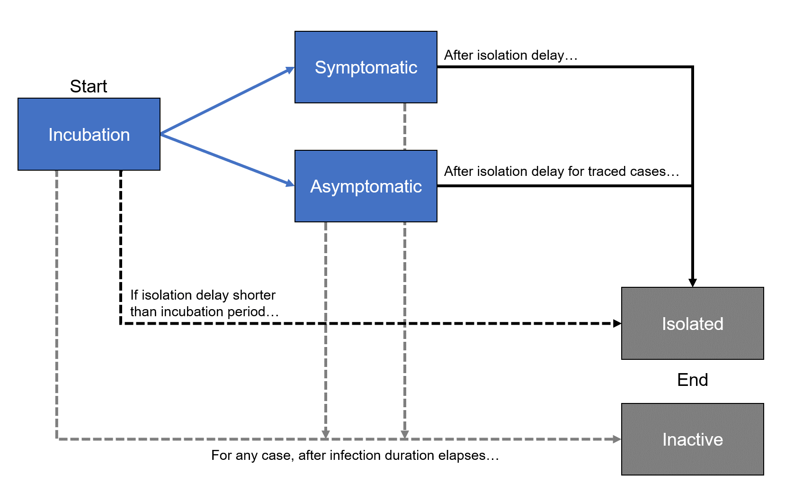

```{r, include = FALSE}
knitr::opts_chunk$set(
  collapse = TRUE,
  comment = "#>"
)
```

This introductory vignette gives a high level overview of the package and the simulation algorithm. We will also examine the four main simulation objects. 

In the next vignette, we demonstrate how to set up and run a simple [first example](first_example.html) by using the package's exposed fucntions. In that vignette, we will also show how the output could be used to extract metrics.

In later vignettes, we will look at how to use "driver" functions to set up a series of simulations, run them, and extract metrics to be used in analysis. This package also contains some example driver functions but more advanced analysis will require a user-customized driver function.

## Simulation algorithm

This package implements a [stochastic branching process](https://en.wikipedia.org/wiki/Branching_process) inspired by [Hellewell et al. (2020)](https://doi.org/10.1016/S2214-109X(20)30074-7) to simulate the evolution of an infectious disease in a population in the presence of factors that add to disease growth (such as importation of cases) and interventions that limit disease growth (such as contact tracing and isolation). All disease and behaviourial parameters for each case are stochastically generated from user-defined distribution when each case is initialized. This includes properties such as time to symptom onset and time of secondary infections (serial intervals). Because our simulation runs forward one time-step at a time, disease milestones such as symptom onset or secondary infections are essentially "pre-loaded" when the case is generated but don't actually occur in the simulation until the correct timestep. This allows an easier view of the status at a given time, and also allows for processes to be time-dependent and/or depend on the current state of other cases (e.g. the efficiency of contact tracing could depend on the number of active cases requiring tracing). 

### Case statuses
We consider every case to be in one of five disease states:

* **incubation**: All cases currently begin here, which represents a state where a person has been infected and could infect others. All four other states are possible from the incubation stage. After the case's incubation period (a stochastically drawn parameter) has passed, the case moves onto the **symptomatic** or **asyptomatic** state, depending on whether the case is symptomatic (also a stochastically determined value). However, cases can immediately move from **incubation** to the **isolated** state if their isolation time is shorter than the incubation period, which could happen when the case is a traced contact of an isolated index case. In addition, if the infection duration has passed before the end of the incubation period, then the cases moves to the **inactive** state. This pathway is relatively rare, only happening when the stochastic process generates a very long incubation period.

* **symptomatic**: This state represents cases that are determined to be symptomatic and pass their incubation period without being isolated or going beyond their infection duration. Cases in this state can cause secondary infections. For untraced cases, this milestone is important as it starts the counter for their isolation timeline, as their delay to isolation is counted from symptom onset.  Cases in this state will move to the **isolated** state or the **inactive** state, depending on whether they reach their isolation time or the end of their infection duration first.

* **asymptomatic**: This state represents cases that are determined to be symptomatic and pass their incubation period without being isolated or going beyond their infection duration. Cases in this state can cause secondary infections. Traced asymptomatic cases may move to the **isolated** state if their isolation delay is shorter than their infection duration, otherwise they move to the **inactive** state at the end of their infection. Untraced asymptomatic cases can only move to the **inactive** state after their infection duration has passed. Note that the infection duration can be set to a very large number, in which case untraced asymptomatic cases may remain in the **asymptomatic** indefinitely.

* **isolated**: This state represents cases that have been isolated from the main population and can no longer cause secondary infections. Traced cases arrive here from any of the above states after some stochastically determined delay beyond the index case's isolation. This delay can be as short as 0 days. Untraced cases arrive here after a different stochastically determined delay beyond their own onset of symptoms (if symptomatic). This is one of two potential end states: cases that reach this state will remain here for the rest of the simulation. 

* **inactive**: This state represent cases that are not isolated but are no longer considered to have the disease and are no longer causing secondary infections. Cases can arrive here from the **incubation**, **symptomatic** or **asymptomatic** states if they reach the end of their stochastically drawn infection duration period before advancing to the **isolated** state. The use of this state is optional: if the infection duration parameter is set to a very large value (e.g. longer than the total length of the simulation) then cases will never reach this state. The purpose of this state is to avoid retaining a very large number of untraced asymptomatic cases that are no longer affecting the simulation as well as to avoid the rare situation where the serial interval distribution leads to a stochastic draw of an unrealistic and very large serial interval (in cases where this event is not meant to be included in the simulation).

Depending on the application, some specific states can be used as proxies for other useful metrics. For instance, the count of cases in the symptomatic state can be used to measure healthcare capacity required. Alternatively, we could consider some percentage of all active cases (incubation, symptomatic and asymptomatic) will require varying levels of medical interventions (e.g. hopsitalizations, ICU). The count of isolated cases can be used as an imperfect proxy for cases known to public health authorities, especially if assuming isolation orders come from these authorities and/or people self-isolate after self-reporting. 

{width=100%}

### What happens in each timestep
This is the order of operations in each simulation timestep as implemented by the `step_simulation()` function.

1. The overall simulation time counter and each case's time infected counter is incremented by the timestep.

2. Secondary infections that would have occured since the last timestep are generated with all of their stochastically determined parameters drawn from their respective distribution. This list of secondary cases is kept separate from the list of current active cases in the simulation for now.

3. If the timestep is a whole number, then the number of imported cases is determined and these cases are generated with all of their stochastically determined parameters drawn from their respective distributions. This list of imported cases is kept separate from the list of current active cases in the simulation for now.

4. All cases that have been active for longer than their infection duration since the last timestep are advanced to the inactive state and are not considered for any further case status advancements.

5. The remaining active cases are assessed for advancement.
  + Cases in the incubation state are advanced to symptomatic, asymptomatic or directly to isolated based on the timelines described above.
  + Then, cases in the symptomatic state are advanced to isolated if they meet the conditions.
  + Finally, cases in the asymptomatic state are advanced to isolated if they meet the conditions.
  
6. Cases now in the inactive or isolated states are removed from the active cases list.

7. New secondary and imported cases generated earlier are added to the bottom of the active cases list, in that order.

8. End of timestep.

## Description of main simulation objects

The simulation is controlled by four objects that contain information about the disease parameters for the simulation run, the current status of the simulation and the output. We keep all information within these objects so that we just have to pass the objects to the functions and adding new features is just adding more entries to these named list/matrix or dataframe objects. These four objects are:

* `sim.params` is a named list containing the global parameters that will affect all cases. These include the disease parameters, simulation control parameters, and the definition of the distributions used to draw case-specific parameters. The contents of this list are constant within a simulation.

* `sim.status` is a named list acting as the "state vector" containing bookkeeping quantities not specific to any case that is generally updated at every timestep of the simulation.

* `state_df` is a data frame acting as a state vector for all active cases. It should contain all the information about the case which is required to determine what happens to that case during a simulation. It is updated several times during each simulation step.

* `record_df` is a data frame acting as a log of important attributes of all cases ever created in the simulation. It is also updated several times during each simulation step.

**N.B.** The general idea is that `state_df` only contains information required to determine the trajectory of a case in a simulation. Cases that are no longer active are removed from `state_df` at the end of each step. On the other hand, `record_df` tracks quantities of interest for all cases in the simulation. Driver functions should be sampling from one or both of these two objects to generate summary metrics for analysis.


## Next steps
Ready for your first simulation? This [first example](first_example.html) vignette will go through the steps to set up a simulation, run it, and extract metrics from it.

In the future, we will present vignettes showing examples of this package applied to outbreak simulation on a large scale, such as a vignette reproducing the main results from [Hellewell et al. (2020)](https://doi.org/10.1016/S2214-109X(20)30074-7). We will also show vignettes that demonstrate one method to fit to reported case counts and forecast future case counts. They will be linked here when ready.

## References
[Hellewell et al. (2020)](https://doi.org/10.1016/S2214-109X(20)30074-7), "Feasibility of controlling COVID-19 outbreaks by isolation of cases and contacts", *The Lancet Global Health*, Vol. 8, E488-E496.
